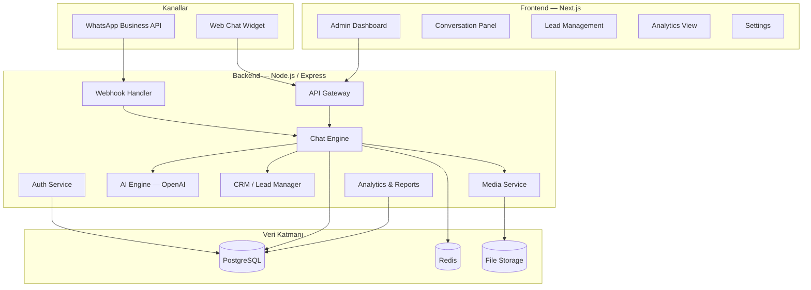
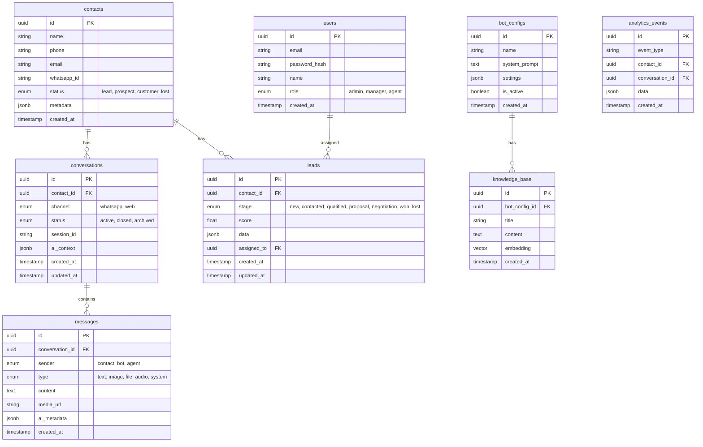

# 🤖 Sales Agent ChatBot — Implementation Plan

## Proje Özeti

WhatsApp ve web üzerinden çalışan, lead'leri müşteriye dönüştürme odaklı, AI destekli Sales Agent Chatbot sistemi.

---

## 🏗️ Mimari Genel Bakış



---

## 🛠️ Teknoloji Stack

| Katman | Teknoloji | Neden |
|--------|-----------|-------|
| **Backend** | Node.js + Express + TypeScript | Hızlı geliştirme, WhatsApp webhook desteği |
| **Frontend** | Next.js 14 + React + TypeScript | SSR, modern UI, dashboard için ideal |
| **Veritabanı** | PostgreSQL | İlişkisel veri, CRM ve analitik için güçlü |
| **Cache / Session** | Redis | Oturum yönetimi, rate limiting, gerçek zamanlı |
| **AI** | OpenAI GPT-4o + Vision API | Metin + görsel analiz |
| **WhatsApp** | Meta Cloud API (WhatsApp Business) | Resmi API, güvenilir |
| **Dosya Depolama** | MinIO (S3 uyumlu) | Self-hosted, Coolify ile kolay |
| **Gerçek Zamanlı** | Socket.IO | Web chat ve canlı dashboard güncellemeler |
| **Auth** | JWT + bcrypt | Güvenli oturum yönetimi |
| **Deploy** | Docker + Coolify + GitHub | Otomatik CI/CD |
| **DNS/SSL** | Cloudflare Tunnel | Güvenli erişim, SSL otomatik |

---

## 📊 Veritabanı Şeması



---

## 📁 Proje Yapısı

```
chatbot-project/
├── docker-compose.yml
├── .env.example
├── .github/
│   └── workflows/
│       └── deploy.yml
│
├── backend/
│   ├── Dockerfile
│   ├── package.json
│   ├── tsconfig.json
│   └── src/
│       ├── index.ts                 # Entry point
│       ├── config/
│       │   ├── database.ts
│       │   ├── redis.ts
│       │   └── env.ts
│       ├── middleware/
│       │   ├── auth.ts
│       │   ├── errorHandler.ts
│       │   └── rateLimiter.ts
│       ├── routes/
│       │   ├── auth.routes.ts
│       │   ├── chat.routes.ts
│       │   ├── contacts.routes.ts
│       │   ├── leads.routes.ts
│       │   ├── analytics.routes.ts
│       │   ├── webhook.routes.ts
│       │   └── settings.routes.ts
│       ├── services/
│       │   ├── ai.service.ts        # OpenAI entegrasyonu
│       │   ├── chat.service.ts      # Sohbet yönetimi
│       │   ├── whatsapp.service.ts  # WhatsApp API
│       │   ├── crm.service.ts       # Lead/Contact yönetimi
│       │   ├── media.service.ts     # Dosya/resim işleme
│       │   ├── analytics.service.ts # Analitik
│       │   └── report.service.ts    # Rapor oluşturma
│       ├── models/
│       │   ├── User.ts
│       │   ├── Contact.ts
│       │   ├── Conversation.ts
│       │   ├── Message.ts
│       │   ├── Lead.ts
│       │   └── BotConfig.ts
│       ├── utils/
│       │   ├── logger.ts
│       │   ├── validators.ts
│       │   └── helpers.ts
│       └── types/
│           └── index.ts
│
├── frontend/
│   ├── Dockerfile
│   ├── package.json
│   ├── next.config.js
│   └── src/
│       ├── app/
│       │   ├── layout.tsx
│       │   ├── page.tsx              # Login
│       │   ├── dashboard/
│       │   │   ├── page.tsx          # Ana dashboard
│       │   │   ├── conversations/
│       │   │   │   └── page.tsx
│       │   │   ├── contacts/
│       │   │   │   └── page.tsx
│       │   │   ├── leads/
│       │   │   │   └── page.tsx
│       │   │   ├── analytics/
│       │   │   │   └── page.tsx
│       │   │   └── settings/
│       │   │       └── page.tsx
│       │   └── chat/
│       │       └── [id]/page.tsx     # Embeddable chat widget
│       ├── components/
│       │   ├── ui/                   # Genel UI bileşenleri
│       │   ├── chat/                 # Chat bileşenleri
│       │   ├── dashboard/            # Dashboard bileşenleri
│       │   └── layouts/              # Layout bileşenleri
│       ├── hooks/
│       ├── lib/
│       │   ├── api.ts
│       │   └── socket.ts
│       └── styles/
│           └── globals.css
│
└── widget/                           # Embed edilebilir chat widget
    ├── index.html
    └── widget.js
```

---

## 🚀 Fazlar

### Faz 1: Temel Altyapı ⏱️ ~2-3 saat
- [x] Proje yapısı oluşturma
- [ ] Docker Compose kurulumu (PostgreSQL, Redis, MinIO)
- [ ] Backend Express sunucu kurulumu
- [ ] Veritabanı bağlantısı ve migration'lar
- [ ] Authentication sistemi (register, login, JWT)
- [ ] Temel API yapısı ve middleware'ler

### Faz 2: AI Chat Engine ⏱️ ~2-3 saat
- [ ] OpenAI GPT-4o entegrasyonu
- [ ] Sohbet yönetimi (oluştur, mesaj gönder, geçmiş)
- [ ] Bağlam yönetimi (context window)
- [ ] Görsel analiz (Vision API)
- [ ] Dosya yükleme ve işleme
- [ ] Bot konfigürasyon sistemi (system prompt, ayarlar)
- [ ] Knowledge Base / RAG desteği

### Faz 3: WhatsApp Entegrasyonu ⏱️ ~2-3 saat
- [ ] Meta WhatsApp Business API kurulumu
- [ ] Webhook endpoint'leri
- [ ] Gelen mesaj işleme
- [ ] Medya mesajları (resim, dosya, ses)
- [ ] Şablon mesajlar
- [ ] Müşteri kimlik eşleştirme (WhatsApp ↔ Web)

### Faz 4: Web Dashboard ⏱️ ~3-4 saat
- [ ] Next.js frontend kurulumu
- [ ] Login / Auth sayfaları
- [ ] Ana Dashboard (KPI'lar, grafikler)
- [ ] Sohbet Paneli (gerçek zamanlı)
- [ ] İletişim Yönetimi
- [ ] Lead Pipeline (Kanban board)
- [ ] Bot Ayarları sayfası
- [ ] Embeddable Web Chat Widget

### Faz 5: Analitik & Raporlama ⏱️ ~2 saat
- [ ] Sohbet analitiği (yanıt süresi, memnuniyet)
- [ ] Lead dönüşüm metrikleri
- [ ] Kanal performansı (WhatsApp vs Web)
- [ ] Otomatik rapor oluşturma (PDF)
- [ ] CSV/Excel export
- [ ] Gerçek zamanlı dashboard güncellemeler

### Faz 6: Deployment ⏱️ ~1-2 saat
- [ ] Dockerfile'lar (backend + frontend)
- [ ] docker-compose.production.yml
- [ ] GitHub repo kurulumu
- [ ] Coolify proje oluşturma
- [ ] Cloudflare Tunnel konfigürasyonu
- [ ] SSL ve domain ayarları
- [ ] CI/CD pipeline

---

## 🔑 Gerekli Hesaplar / API Anahtarları

| Servis | Amaç | Durum |
|--------|-------|-------|
| **OpenAI API Key** | AI chat motoru | ❓ Mevcut mu? |
| **Meta Business Account** | WhatsApp Business API | ❓ Kurulu mu? |
| **WhatsApp Business Phone** | WhatsApp mesajlaşma | ❓ Numara hazır mı? |
| **GitHub Account** | Kod deposu | ❓ Repo oluşturulacak |
| **Coolify** | Deployment | ✅ coolify.omeryilmaz.me |
| **Cloudflare** | DNS/Tunnel | ❓ Yapılandırılacak |

---

## 🎯 Temel Özellikler Detayı

### Sales Agent Mantığı
- Otomatik lead skorlama (AI destekli)
- Satış hunisi (funnel) yönetimi
- Otomatik takip mesajları
- Müşteri segmentasyonu
- Kişiselleştirilmiş yanıtlar

### Çok Kanallı Kimlik Yönetimi
- WhatsApp numarası ile web oturumu eşleştirme
- Tek müşteri profili altında tüm kanallar
- Kanal geçişlerinde bağlam koruma
- Sohbet geçmişi birleştirme

### Akıllı Yanıt Sistemi
- Bağlama duyarlı AI yanıtlar
- Ürün/hizmet bilgi tabanı
- FAQ otomatik yanıtlama
- Karmaşık sorularda insan agent'a yönlendirme
- Duygu analizi

---

> [!IMPORTANT]
> **İlk adım olarak şunları onaylamanı istiyorum:**
> 1. Bu plan sana uygun mu? Eklemek/çıkarmak istediğin bir şey var mı?
> 2. OpenAI API Key'in hazır mı?
> 3. Meta Business hesabın var mı? (WhatsApp Business API için gerekli)
> 4. GitHub'da repo adı ne olsun? (örn: `sales-chatbot`)
> 5. Chatbot hangi subdomain'de çalışsın? (örn: `chat.omeryilmaz.me`)
